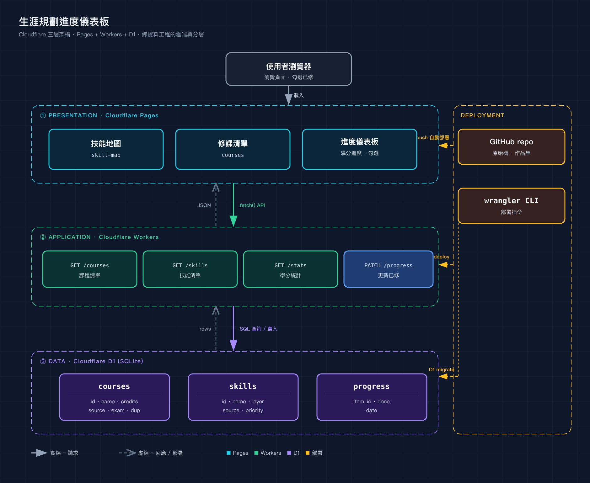

# career-dashboard · 生涯規劃進度儀表板

Cloudflare 全家桶練習：一個三層全端小專案，追蹤大學修課與技能養成進度，可勾選「已修」、學分進度條即時更新。

**線上 demo**：https://career-dashboard.nicktodj.workers.dev



## 架構（三層）

| 層 | 用什麼 | 檔案 |
|---|---|---|
| Presentation（前端） | Cloudflare Pages | `public/index.html` |
| Application（API） | Cloudflare Workers | `src/index.js` |
| Data（資料庫） | Cloudflare D1 (SQLite) | `migrations/` · `seed.sql` |

資料流：前端 `fetch` → Workers API → 查／寫 D1 → 回 JSON → 前端渲染；勾選已修 → `PATCH` → 寫 D1 → 重算進度。

## API

| Endpoint | 說明 |
|---|---|
| `GET /api/courses` | 課程清單（含完成狀態） |
| `GET /api/skills` | 技能清單 |
| `GET /api/stats` | 各來源學分統計 |
| `PATCH /api/progress` | 更新完成狀態 |

## 本地開發

```bash
npm install
npx wrangler d1 execute career-dashboard-db --local --file=seed.sql
npx wrangler dev          # http://localhost:8787
```

## 部署到 Cloudflare

```bash
npx wrangler d1 migrations apply career-dashboard-db --remote
npx wrangler d1 execute career-dashboard-db --remote --file=seed.sql
npx wrangler deploy
```

## 技術棧

Cloudflare Pages / Workers / D1 · 原生 JavaScript · SQL · wrangler
